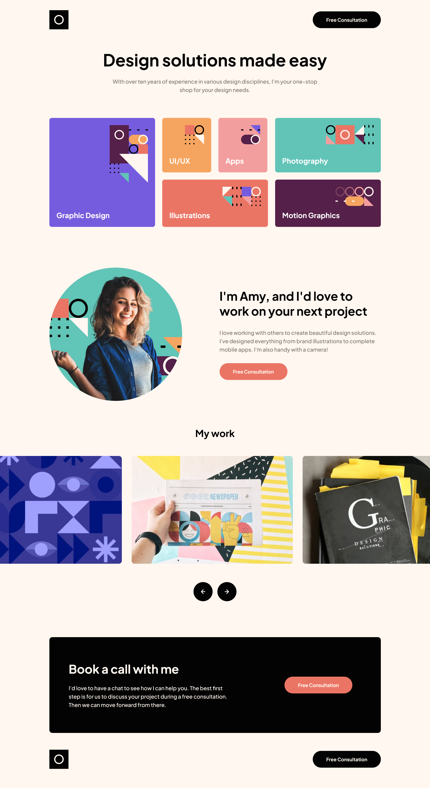

# Frontend Mentor - Single-page design portfolio solution

This is my solution to the [Single-page design portfolio challenge on Frontend Mentor](https://www.frontendmentor.io/challenges/singlepage-design-portfolio-2MMhyhfKVo). Frontend Mentor challenges help you improve your coding skills by building realistic projects. 

## Table of contents

- [Overview](#overview)
  - [The challenge](#the-challenge)
  - [Screenshot](#screenshot)
  - [Links](#links)
- [My process](#my-process)
  - [Built with](#built-with)
  - [What I learned](#what-i-learned)
- [Author](#author)

## Overview

### The challenge

Users should be able to:

- View the optimal layout for the site depending on their device's screen size
- See hover states for all interactive elements on the page
- Navigate the slider using either their mouse/trackpad or keyboard

### Screenshots

#### Desktop

#### Tablet

#### Mobile

### Links

- Solution URL: [Add solution URL here](https://your-solution-url.com)
- Live Site URL: [https://manondupriez.github.io/single-page-design-portfolio/](https://manondupriez.github.io/single-page-design-portfolio/)

## My process

### Built with

- [Tailwind CSS](https://tailwindcss.com/) - CSS framework
- Flexbox
- Semantic HTML5 markup
- Mobile-first workflow

### What I learned

It was my first time working with Tailwind CSS. I learned how to use the utility classes provided by the framework, but also how to customize them and create my own variables.

I love turning designs into code and matching layouts as closely as possible to the original mockups — and I found that Tailwind CSS is especially well-suited for that. It's a different way of working, since you rarely leave your HTML file, but it's actually very enjoyable! I appreciated how fast it was to implement a design.

## Author

- Frontend Mentor - [@manondupriez](https://www.frontendmentor.io/profile/manondupriez)